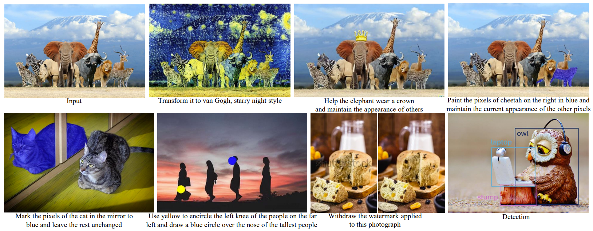

# InstructDiffusion: A Generalist Modeling Interface for Vision Tasks

<p align="center">
  <a href="https://gengzigang.github.io/instructdiffusion.github.io/">Project Page</a> |
  <a href="https://arxiv.org/pdf/2309.03895.pdf">Arxiv</a> |
  <a href="https://e0448e59d09dbe092f.gradio.live">Web Demo</a> |
  <a href="#QuickStart">QuickStart</a> |
  <a href="#Training">Training</a> |
  <a href="#Acknowledge">Acknowledge</a> |
  <a href='#Citation'>Citation</a> 
</p>

<div align="center">
  
</div>

This is the pytorch implementation of InstructDiffusion, a unifying and generic framework for aligning computer vision tasks with human instructions. Our code is based on the [Instruct-pix2pix](https://github.com/timothybrooks/instruct-pix2pix) and [CompVis/stable_diffusion](https://github.com/CompVis/stable-diffusion).<br>

## QuickStart
Follow the steps below to quickly edit your own images. The inference code in our repository requires **one GPU with > 9GB memory** to test images with a resolution of **512**.

1. Clone this repo.
2. Setup conda environment:
   ```
   conda env create -f environment.yaml
   conda activate instructdiff
   ```
3. We provide a well-trained [checkpoint](https://mailustceducn-my.sharepoint.com/:u:/g/personal/aa397601_mail_ustc_edu_cn/EZmXduulFidIhJD73SGcbOoBNpm18CJmU4PgPTS21RM2Ow?e=KqQYpO) and a [checkpoint](https://mailustceducn-my.sharepoint.com/:u:/g/personal/aa397601_mail_ustc_edu_cn/EWlNmyeS9P1BkRg_IlXbPbwBeNMQXQTcIA0pCokyd61UWg?e=iKfRdk) that has undergone human-alignment. Feel free to download to the folder `checkpoints` and try both of them.

4. You can edit your own images:
```bash
python edit_cli.py --input example.jpg --edit "Transform it to van Gogh, starry night style."

# Optionally, you can customize the parameters by using the following syntax: 
# --resolution 512 --steps 50 --config configs/instruct_diffusion.yaml --ckpt YOUR_CHECKPOINT --cfg-text 3.5 --cfg-image 1.25

# We also support loading image from the website and edit, e.g., you could run the command like this:
python edit_cli.py --input "https://wallup.net/wp-content/uploads/2016/01/207131-animals-nature-lion.jpg" \
   --edit "Transform it to van Gogh, starry night style." \
   --resolution 512 --steps 50 \
   --config configs/instruct_diffusion.yaml \
   --ckpt checkpoints/v1-5-pruned-emaonly-adaption-task-humanalign.ckpt \
   --outdir logs/
```
For other different tasks, we provide recommended parameter settings, which can be found in [`scripts/inference_example.sh`](./scripts/inference_example.sh).

5. (Optional) You can launch your own interactive editing Gradio app:
```bash
python edit_app.py 

# You can also specify the path to the checkpoint
# The default checkpoint is checkpoints/v1-5-pruned-emaonly-adaption-task-humanalign.ckpt
python edit_app.py --ckpt checkpoints/v1-5-pruned-emaonly-adaption-task-humanalign.ckpt
```

## Training
The code is developed using python 3.8 on Ubuntu 18.04. The code is developed and tested using 48 NVIDIA V100 GPU cards, each with 32GB of memory. Other platforms are not fully tested.

### Installation
1. Clone this repo.
2. Setup conda environment:
   ```
   conda env create -f environment.yaml
   conda activate instructdiff
   ```

### Pre-trained Model Preparation
You can use the following command to download the official pre-trained stable diffusion model, or you can download the model trained by our pretraining adaptation process from [OneDrive](https://mailustceducn-my.sharepoint.com/:u:/g/personal/aa397601_mail_ustc_edu_cn/EXJSMIpFev5Nj0kuKI88U1IBZDSjegp3G8ukku0OxRRjFQ?e=QhnnB4) and put it into the following folder: stable_diffusion/models/ldm/stable-diffusion-v1/.
   ```
   bash scripts/download_pretrained_sd.sh
   ```

### Data Preparation
You can refer to the [dataset](https://github.com/Gengzigang/InstructDiffusion/tree/main/dataset) to prepare your data.

### Training Command
For multi-GPU training on a single machine, you can use the following command:
   ```
   python -m torch.distributed.launch --nproc_per_node=8 main.py --name v0 --base configs/instruct_diffusion.yaml --train --logdir logs/instruct_diffusion
   ```

For multi-GPU training on multiple machines, you can use the following command (assuming 6 machines as an example):
   ```
   bash run_multinode.sh instruct_diffusion v0 6
   ```

### Convert EMA-Model
You can get the final EMA checkpoint for inference using the command below:
   ```
   python convert_ckpt.py --ema-ckpt logs/instruct_diffusion/checkpoint/ckpt_epoch_200/state.pth --out-ckpt checkpoints/v1-5-pruned-emaonly-adaption-task.ckpt
   ```

## Acknowledge

Thanks to 
- [Stable-diffusion](https://github.com/CompVis/stable-diffusion)
- [Instruct-pix2pix](https://github.com/timothybrooks/instruct-pix2pix)

## Citation

```
@inproceedings{Geng23instructdiff,
	author={Zigang Geng, Binxin Yang, Tiankai Hang, Chen Li, Shuyang Gu, Ting Zhang, Jianmin Bao, Zheng Zhang, Han Hu, Dong Chen, Baining Guo},
	title={InstructDiffusion: A Generalist Modeling Interface for Vision Tasks},
	booktitle={{Arxiv}},
	year={2023}, 
}
```
